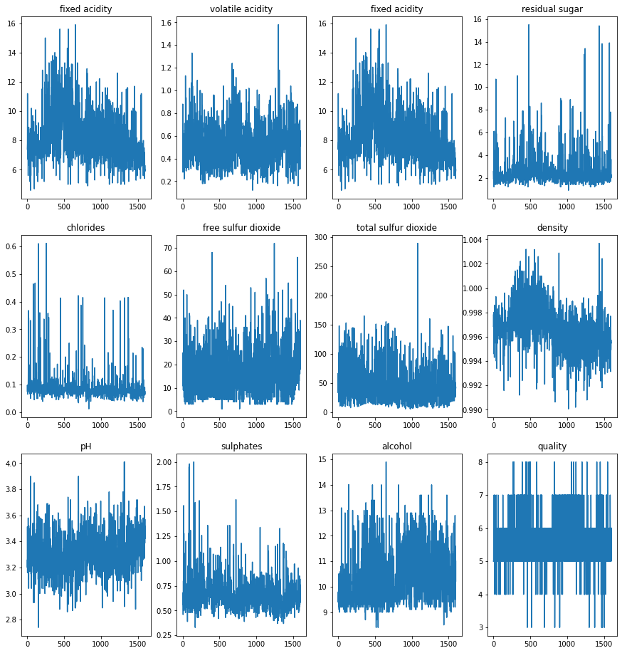

Use Anaconda  to Create environment 
---
1. To create environment  with a specific version of Python:

``
conda create --name myenv python=3.9
``

2. When conda asks you to proceed, type y:

``
proceed ([y]/n)?
``

*This creates the myenv environment . 
No packages will be installed in this environment*

3. Activate your environment

``
conda activate myenv
``

4. Install the any required packages 

``
pip install opencv-python
``

5. Check Installed packages in your environment

``
conda list
``
#
Script Name 1 : channel_counter
---
**Run Script**

 ``
 python channel_counter.py
 ``

pwd of your folder and copy the path in **folder_path**
```
folder_path ='D:\Image_Format_Converter\F2'
```
Output :

>Total Number of grayscale images : 1

>Total Number of 3-channel images : 12

Script Name 2  : image_resizer
---
 * This script can resize any image by **scale percent** or  with **customization** (height & width)
 * Change to any image format(png/jpg/webp)

**Run**

 ``
 python image_resizer.py
 ``


The script uses argument parser  has 
4 arguments and 2commands 

  **Select Command : scale**

>Run this command to resize by scale percent 

 ``
 python image_resizer.py --input_path  --output_path 
  --input_format  --output_format  scale --scale_percent 
 ``

*example*
 ```
 python image_resizer.py --input_path F2 --output_path f3 --input_format jpg --output_format png  scale --scale_percent 50
 ````


**Select Command : dsize**


 >Run this command to resize by taking height and width

``
python image_resizer.py --input_path  --output_path  --input_format  --output_format   dsize  --height  --width 
``


*example*
````
python image_resizer.py --input_path F2 --output_path f3 --input_format jpg --output_format png  dsize  --height 10 --width 10
````

-------
Script Name 3 : image_orientation_checker
-----

This script 

* sort all the images into 3 categories : Potrait /Square /Landscape

* Generates a csv-file with 3columns that consists of the corresponding image file names.


**Run Script**

 ``
 python image_orientation_checker.py
 ``

1. pwd of your folder and copy the path in **folder_path**

2. Create three folders and input the file directory in the given variables by the following convention : 


| Folder Name | path |
| ----------- | ----------- |
| Potrait Images | potpath |
| Square Images | sqpath |
| Landscape Images | landpath |

3. CSV output should be like :

>Potrait,Square,Landscape

 >img11.jpg,img1.jpg,img10.jpg
 img12.jpg,img6.jpg,img2.jpg
 img5.jpg,img7.jpg,img3.jpg
 ,img8.jpg,img4.jpg
 ,img9.jpg, 
 
-------
Script Name 4 : plot_data_fromcsv
-----

This script 
* reads any given csv file 
* checks for null values

* plots each column data


**Run this script on Google Colab using the following link :**

https://colab.research.google.com/drive/1zRm_aHJxRs4ZtVc_mTn0Jj47C9Mzq5In?usp=sharing


* Run all the cells accordingly
* pwd and save the file directory in datafram (df): 
>df = pd.read_csv('/content/drive/My Drive/winequality-red.csv')

* Change the column names according to you csv file.
>a = df['column name'].values 

* Check for null value in each column 
>df['column name'].isnull().values.any().sum()

* plot each columns as subplots
>fig.add_subplot(3,4,1).set_title('column name')

>plt.plot(df['column name'])

Output :




-------
Script Name 5 : histogram_grayscaleimage
-----
**Run this script on Google Colab using the following link :**

https://colab.research.google.com/drive/1P1w5LubxjGtv9C2I2zBH7uE1OJ9PXJ0M?usp=sharing

* pwd and change the file directory here :

>A= cv2.imread('/content/drive/My Drive/content/col.jpg')

* Run all the cells accordingly
-------
Script Name 6 : histogram_rgb
-----

This script is written without using the histogram library.

**Run this script on Google Colab using the following link :**

This script is written without using the histogram library.

https://colab.research.google.com/drive/1cOAAGtBdR0N0MyvaMy5Y-8iXLUISepvc?usp=sharing

* Run all the cells accordingly
* pwd and change the file directory here :
>A= cv2.imread('/content/drive/My Drive/content/col.jpg')